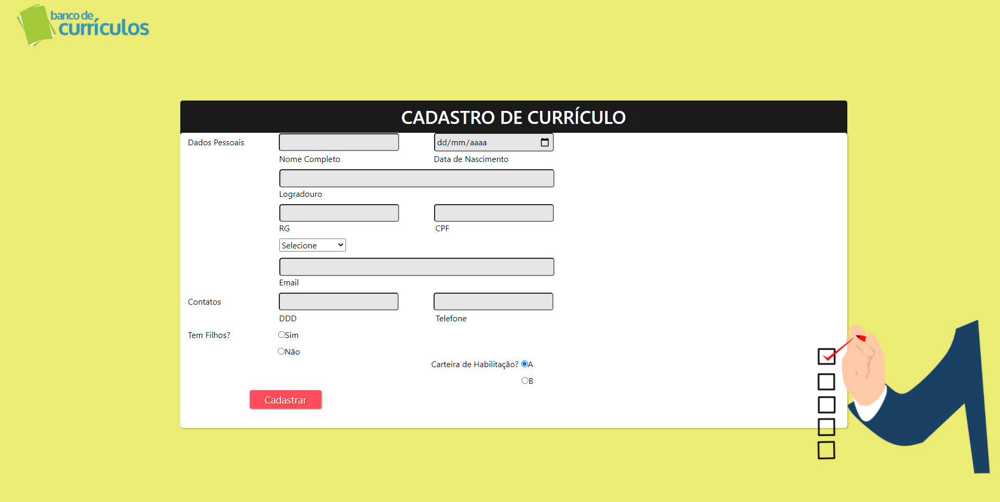
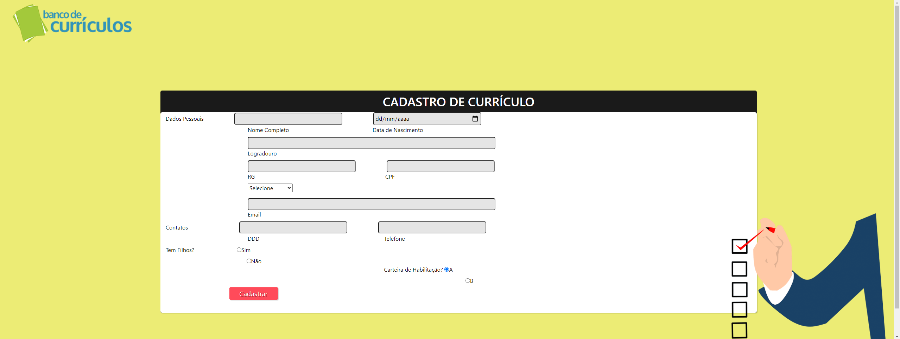

# Formulário Cadastro Revisão

### Revisando formulários, além da utilização de bootstrap... focado em 16:9 e outras resoluções... Para tornar os inputs responsivos, apenas adicionar media query ao código. 

